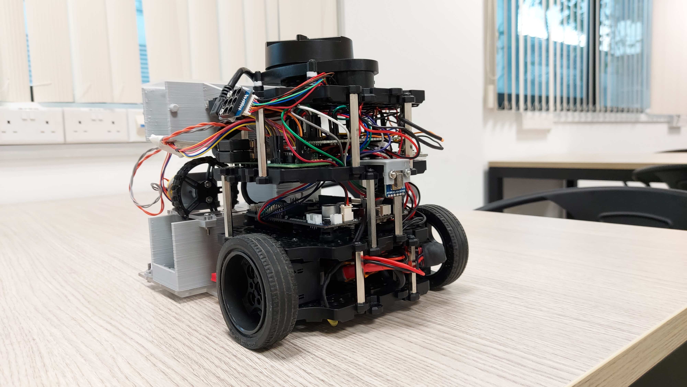

<h1> r2auto_nav </h1>

<h2><b>McTruck</b></h2>

Group 8: Aytree Basak, Ding Yitian, Tan Chern Lin Justin, Teoh Xu En

For module EG2310: Fundamentals of System Design, AY 21/22 Sem 2, part of the Innovation and Design Programme, NUS




## Repository Structure

This repository contains all the code that is necessary for a TurtleBot to map a closed connected unknown maze by following a wall (users can indicate if they want the robot to follow the left or right wall), detect and stop at loading zone demarcated by NFC tags and shoot a ping-pong ball to an IR target (provided the firing mechanism used is the same as ours). You can go to our [Documentations](Documentations) folder to obtain more detailed information about our mechanical, electrical and software design. 

- [Original_Files](Original_Files) folder contains all the original files that comes with the initial fork from [shihchengyen's r2auto_nav repository](https://github.com/shihchengyen/r2auto_nav) and are <b>not</b> necessary for the TurtleBot to navigate the maze by wall following, identify the IR target, and fire.
- [rpi](rpi) folder contains the files on the RPi onboard the turtlebot. The files within this folder allows the turtlebot to read from the sensors installed, control the launcher and communicate with the laptops sending commands. 
- [dtnav.py](dtnav.py) file is the wall following code which has been calibrated to fit our robots' needs. The code uses a decision tree to decide its actions when wall following.
- [trinav.py](trinav.py) file is the wall following code which calculates the angle of the robot to the wall and determine its locomotion when following the wall
- [tri2nav.py](tri2nav.py) file is similar to trinav. However, the parameters has been tuned for the robot and targetting and firing has been improved to move away from surrounding obstacles. 
- [mapping.py](mapping.py) file is used to generate the map of the maze. It also publishes if the mapping is completed. It also contains the alogrithm to identify the frontiers of a explored region given a map.
- [astar.py](astary.py) is a dependency of mapping.py. It contains the A* algorithm that is used to search for a path given two points a map. 
- [rpi/control.py](rpi/control.py) file is the code to read values from the thermal sensor, NFC sensor and the LDR. It also controls the stepper motor and the flywheel motor. Also, it enables to rpi to send information to the laptops. 
- [rpi/flywheel.py](rpi/flywheel.py) is a dependency of rpi/control.py. It contains code to interface with the stepper motor and the flywheel.
- [rpi/pn532.py](rpi/pn532.py) is a dependency of rpi/control.py. It contains code to interface with the NFC sensor.
- [rpi/i2c.py](rpi/i2c.py) is a dependency of rpi/pn532.py. It contains code to utilise the i2c communication protocol onboard the Raspberry Pi.

## Media
- [Photos](Photos) folder contain images of our robot
- Prof Yen uploaded videos of our graded run [here](https://photos.google.com/share/AF1QipMOHCC4Hmy2iMv2cuJiwt46ZaMUjUX0MDv22KL1oktZ5YMMdFfMDikiKv0L4tRCtg?key=cUpqMlcxdmlxRlFrZUQwS3BXZ1cxc0tzVDR4VG5B)

## Variables Configuration

- ```rotatechange``` to adjust the rotation speed of the TurtleBot. 
- ```self.follow``` to change the side of the wall to follow
- ```self.d``` to change detection range for obstacle. E.g.: If ```self.d == 0.35```, if detected distance on LiDAR is less than 0.35m the programme will treat it as an obstacle.
- ```self.wall``` to change wall tracking distance from the wall
- ```self.k_diff``` to tune the robot correction to its distance from the wall
- ```self.k_theta``` to tune the robot correction to its angle from the wall
- ```self.follow_speed``` to tune the robot movement speed
- ```self.heated``` which determines the target detection temperature threshold
  
## Software Block Diagram


## How to Use
On your laptop:
- Create a ROS2 package using ```ros2 pkg create --build-type ament_python <package_name>``` and clone this repository into that package. Make sure to edit the setup.py file  and move the files into the correct folders so that you can run the wall following code.
- Build the package using ```colcon build --packages-select <package_name> --symlink-install```

On the RPi onboard the turtlebot:
- Create a new package using ```ros2 pkg create --build-type ament_python <package_name>```. Make sure to edit the setup.py file and move the files into the correct folders.
- Copy file from the folder ```rpi/``` in this repository into the created package
- Build the package using ```colcon build --packages-select <package_name> --symlink-install```

Running Instructions:
- Start rosbu from the RPi on the TurtleBot after the robot is placed in the maze. Do not touch the robot until the gyro calibration is complete.
- Run ```sudo pigpiod``` on the RPi
- Start rslam from your laptop: 
  ``` ros2 launch turtlebot3_cartographer cartographer.launch.py ```
- Start the code from the RPi on the TurtleBot: 
  ```ros2 run <package_name> control ```
- Start the wall following code from your laptop: 
  ```ros2 run <package_name> tri2nav ```
- Run the code to detect map completition:
  ```ros2 run <package_name> frontier ```

## Testing
The following testing codes are run on the RPi:
- To test run the launching mechanism:
  ```python3 <directory to flywheel.py>/flywheel.py```
- To check values from the LDR and NFC sensor, run ```ros2 run <package_name> control ``` on the RPi first
  - To read the values from the LDR:
    ```ros2 topic echo ldr```
  - To read output of NFC sensor:
    ```ros2 topic echo nfc```

## Frontier detection and path searching (Optional)
- Edit the cartographer configuration file:
  ```
  sudo nano /opt/ros/foxy/share/cartographer/configuration_files/trajectory_builder_2d.lua
  ```
- Change the value of ```resolution``` to ```0.03```: 
  ```
  grid_options_2d = {
      grid_type = "PROBABILITY_GRID",
      resolution = 0.03,
    },
  ```
- Run the following command instead to launch rslam: 
  ```
  ros2 launch turtlebot3_cartographer cartographer.launch.py publish_period_sec:="0.2" resolution:="0.03"
  ```
- Uncomment from line 180 to line 225
- Run ```ros2 run <package_name> frontier ```


## Acknowledgements

 The structure of the repository has been forked from  [alvynben's r2auto_nav repository](https://github.com/alvynben/r2auto_nav)

 Group 8 would like to thank the teaching team for their guidance and support throught out the module
