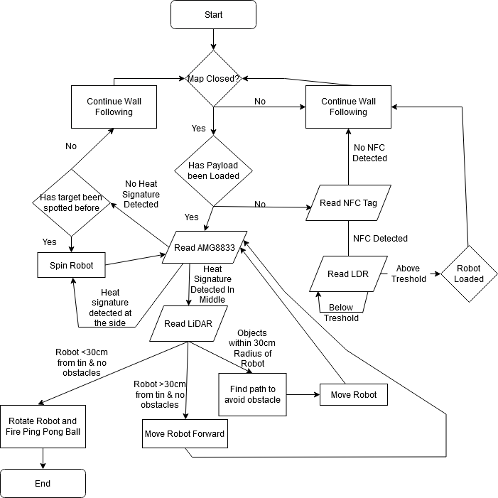

<h1> r2auto_nav </h1>

ROS2 auto_nav code for EG2310 module

## Structure

This repository contains all the code that is necessary for a TurtleBot to map a closed connected unknown maze by following a wall (users can indicate if they want the robot to follow the left or right wall) and shoot a ping-pong ball to an IR target (provided the firing mechanism used is the same as ours). You can go to our Documentation folder to obtain more detailed information about our mechanical, electrical and software design. 

- [dtnav.py](dtnav.py) file is the wall following code which has been calibrated to fit our robots' needs. The code uses a decision tree to decide its actions when wall following.
- [trinav.py](trinav.py) file is the wall following code which calculates the angle of the robot to the wall and determine its locomotion when following the wall
- [tri2nav.py](tri2nav.py) file is similar to trinav. However, the parameters has been tuned for the robot and targetting and firing has been improved to move away from surrounding obstacles. 
- [Original_Files](Original_Files) folder contains all the original files that comes with the initial fork from [shihchengyen's r2auto_nav repository](https://github.com/shihchengyen/r2auto_nav) and are <b>not</b> necessary for the TurtleBot to navigate the maze by wall following, identify the IR target, and fire.
- TODO: add code that needs to be run on turtlebot and possible navigation code

## Software Block Diagram


## Variables Configuration

- ```rotatechange``` to adjust the rotation speed of the TurtleBot. 
- ```self.follow``` to change the side of the wall to follow
- ```self.d``` to change the distance to obstacle
- ```self.k_diff``` to tune the robot correction to its distance from the wall
- ```self.k_theta``` to tune the robot correction to its angle from the wall
- ```self.follow_speed``` to tune the robot movement speed
- ```self.heated``` which determines the target detection temperature threshold

## How to Use

In your laptop:
- Create a ROS2 package and clone this repository into that package. Make sure to edit the setup.py file so that you can run the wall following code.
- Build the package.

In the RPi on the TurtleBot:
- TODO UPDATE
- Create a ROS2 package and copy [r2targeting.py](r2targeting.py) file into that package. Make sure to edit the setup.py file so that you can run the targeting code.
- Build the package.

Running Instructions:
- Start rosbu from the RPi on the TurtleBot.
- Start rslam from your laptop: 
  ``` ros2 launch turtlebot3_cartographer cartographer.launch.py ```
- Start the code from the RPi on the TurtleBot: 
  ```ros2 run <package_name> <entry_point_specified_in_the_setup.py> ```
- Start the wall following code from your laptop: 
  ```ros2 run <package_name> tri2nav ```
